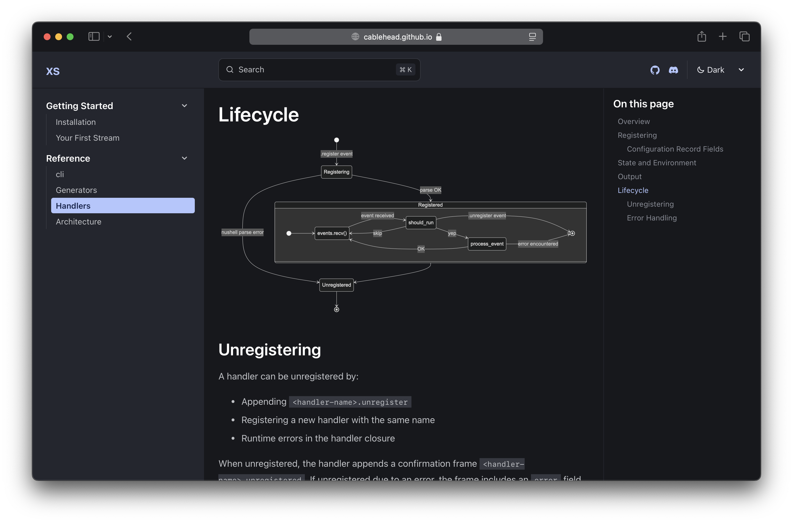
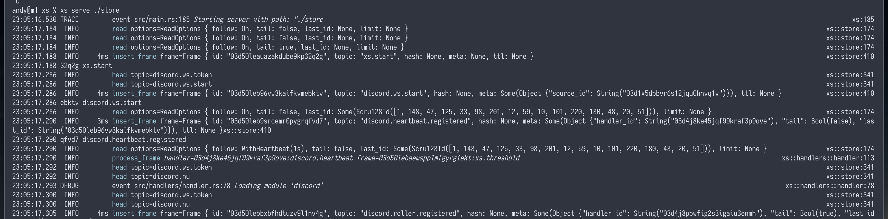

## Highlights

- `.get` is now available as an internal `nu` command (for handlers)
- We have a new docs site, powered by [astro starlight](https://starlight.astro.build) ✨

### Handlers

- `env` is now preserved from your handler configuration script and between handler calls. This makes it convenient to set variables, e.g. access tokens, from your configuration script and to preserve state between handler calls.
- Your configuration script can now specify [modules](https://cablehead.github.io/xs/reference/handlers/#configuration-record-fields) to load for your handler.

### Miscellaneous

- Nushell to v0.101.0 🚀
- Fjall to 2.4.4 🚀
- Improved tracing / logging

## Breaking Changes

- There is no longer the concept of "stateful" handers, which take a second argument for state. Since `env` is preserved between handler calls, you can use that to store state.
- All configuration for handlers has been moved from the frame metadata to a configuration script.
- The handler configuration script now returns a table of configuration options instead of the closure.

## Raw commit messages:

- feat: add .get as in internal nu command
- docs: add reference/generators
- docs: nu-fmt
- docs: port reference/handlers over from the wiki
- docs: typo
- docs: getting-started/first-stream
- docs: tweaks to installation and architecture
- docs: add an architecture overview
- chore: update next release to 0.2.0: we're skipping the path 0.1.1 took
- chore: update to Nushell v0.101.0
- chore: bump fjall dependency to 2.4.4
- docs: getting started / installation
- feat: move handler config out of frame meta to a configuration script (#37)
- fix: restore the .rm to .remove alias
- feat(nu): replace async/await with sync operations in command implementations
- refactor: move AppendCommand buffer to nu/commands
- feat: add sync versions of the Store.cas_* methods
- feat: add a sync version of Store.read: that only retrieves historic frames
- feat: move cleaning up expired frames to a background thread
- feat: drop async from store.append -- it's not needed
- refactor: store into its own module, including ttl
- refactor: move topic_index_key from Store impl to standalone function
- refactor: Store::new doesn't require async
- refactor: move compaction from ReadOptions to inline tasks.rs, match handler pattern
- refactor: consolidate thread pool and span handling
- example(discord): update to make use of modules and with_env
- feat: add with_env variables option to handler registration
- feat: rename use_modules to modules
- feat: add the ability to load modules to handlers
- feat(deps): switch from async-std to tokio runtime for cacache
- chore: .gitignore
- fix: backoff for logging long outstanding spans
- feat: fleshing out tracing (#35)
- fix: updated handlers now start, on restart (#34)
- example(discord): reduce heartbeat ttl to 5mins
