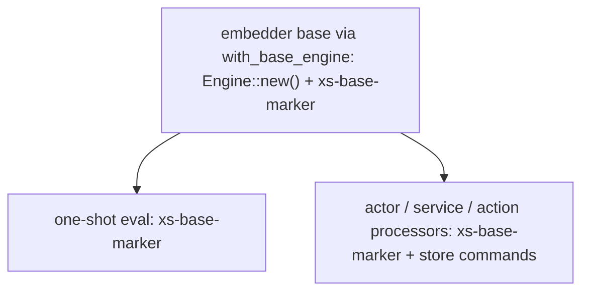

# 0007: Engine tree

xs runs Nushell in two places: the one-shot evaluator and the actor, service, and action processors. Both build their engine from `nu::prepared_base`, a base engine plus the store commands, cloned per spawn.

## Prepare once, clone per use

A subsystem that builds engines repeatedly prepares its base once and clones it per spawn, rather than rebuilding from scratch each time.

## The base

`prepared_base` starts from a base engine and adds the store commands (core, read, and the per-runner write). The base defaults to `Engine::new()`: the nu context, the standard library, and the environment.

## An embedder can supply the base

A program that embeds xs can supply the base via `Store::with_base_engine`, so its own commands reach the processors. `prepared_base` clones the supplied base per spawn and adds the store commands on top; with no base set it uses `Engine::new()`.

The `prepared_base_carries_store_base_engine_commands` test stands in for an embedder: it puts an `xs-base-marker` command on the base and asserts a processor engine resolves it.

## Relation to ADR 0006

[ADR 0006](0006-store-builtins-on-prepared-engine.md) established the prepared, cloneable base and the store-command layering. This ADR lets an embedder supply that base's non-store portion.
