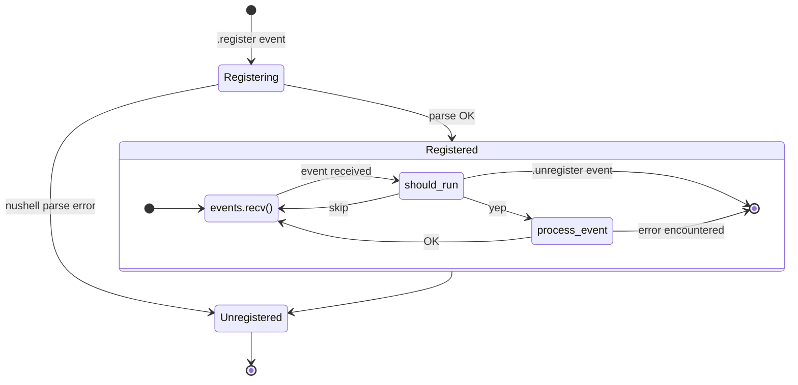

```mermaid
stateDiagram-v2
    [*] --> Registering: .register event
    Registering --> Unregistered: nushell parse error
    Registering --> Registered : parse OK
    Unregistered --> [*]

    state Registered {
        direction LR
        [*] --> events.recv()
        events.recv() --> should_run: event received

        should_run --> events.recv(): skip
        should_run --> process_event: yep
        should_run --> [*]: .unregister event

        process_event --> [*]: error encountered
        process_event --> events.recv(): OK
    }

    Registered --> Unregistered
```
