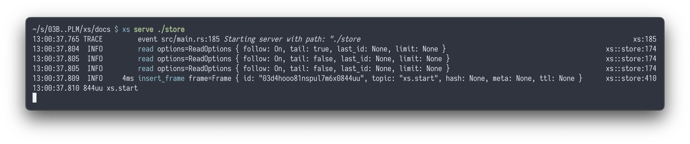
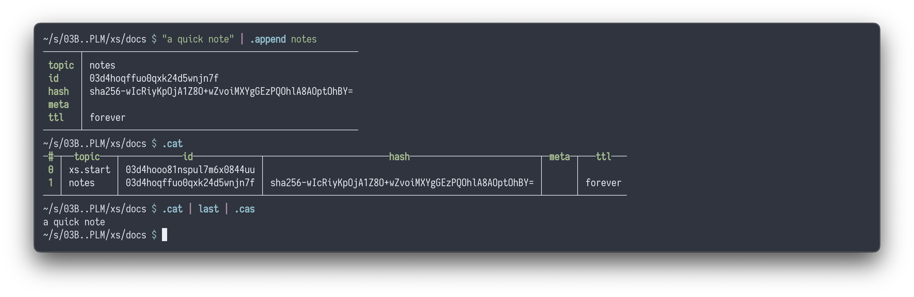
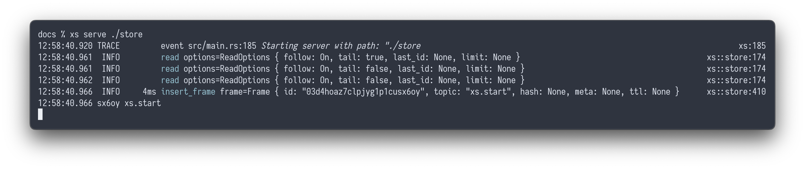
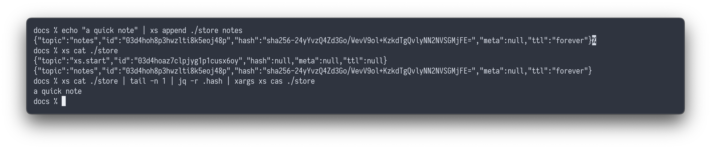

import { Tabs, TabItem } from '@astrojs/starlight/components';

<Tabs syncKey="shell">

<TabItem label="nushell">
```nushell
cargo install cross-stream --locked
use xs.nu *
xs serve ./store
```



```nushell
"a quick note" | .append notes
.cat
.cat | last | .cas  # retrieve the last note
```


</TabItem>

<TabItem label="bash">
```sh
cargo install cross-stream --locked
xs serve ./store
```



```sh
echo "a quick note" | xs append ./store notes
xs cat ./store
xs cat ./store | tail -n 1 | jq -r .hash | xargs xs cas ./store  # retrieve the last note
```

</TabItem>
</Tabs>
