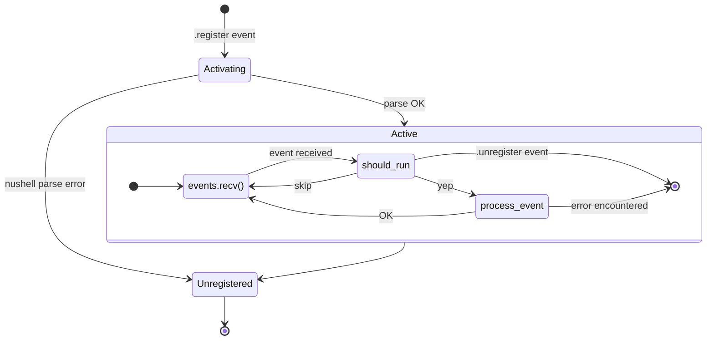

import { Aside, Tabs, TabItem } from '@astrojs/starlight/components';

import { Link } from '../../../utils/links';

cross.stream actors use <Link to="nu" />
[closures](https://www.nushell.sh/lang-guide/chapters/types/basic_types/closure.html)
to process and act on incoming frames as they are appended to the store.

```nushell
{
  run: {|frame|
    if $frame.topic == "ping" {
      "pong" # Will be appended to actor.out
    }
  }
}
```

The actor closure receives each new frame and can:

- Process the frame's content
- Return a value (which gets automatically appended to `<actor-name>.out`)
- Explicitly append new frames using the `.append` command
- Filter which frames to process using conditionals

## Registering

To register an actor, append a registration script with the topic
`<actor-name>.register`. The script must return a record that configures the
actor's behavior:

```nushell
r###'{
  # Required: Actor closure
  run: {|frame|
    if $frame.topic == "ping" {
      "pong" # Will be appended to actor.out
    }
  }

  # Optional: Where to start processing from
  # "new" (default), "first", or scru128 ID
  start: "new"

  # Optional: Heartbeat interval in ms
  pulse: 1000

  # Optional: Control output frame behavior
  return_options: {
    suffix: ".response" # Output topic suffix
    ttl: "last:1" # Keep only most recent frame
  }
}'### | .append echo.register
```

The `run` closure must accept **exactly one positional argument** which is the
incoming frame.

The registration script is stored in CAS and evaluated to obtain the actor's
configuration.

Upon a successful start the actor appends a `<actor-name>.active` frame
with metadata:

- `actor_id` -- the ID of the actor instance
- `new` -- whether processing started from the end of the topic (new items only)
- `after` -- the frame ID that processing resumed after (if any)

### Configuration Record Fields

| Field            | Description                                                                |
| ---------------- | -------------------------------------------------------------------------- |
| `run`            | Required actor closure that processes each frame                           |
| `start`          | "new" (default), "first", or scru128 ID to control where processing starts |
| `pulse`          | Interval in milliseconds to send synthetic xs.pulse events                 |
| `return_options` | Controls output frames: see Return Options                                 |

#### Return Options

The `return_options` field controls how return values are handled:

- `suffix`: String appended to actor's name for output topic (default: ".out")
- `ttl`: Time-to-live for output frames
  - `"forever"`: Never expire
  - `"ephemeral"`: Not stored; only active subscribers receive it
  - `"time:<milliseconds>"`: Expire after duration
  - `"last:<n>"`: Keep only N most recent frames

#### Modules

Actors can use modules registered via `*.nu` topics. An actor sees the modules as they existed when it was registered. See <Link to="/reference/topics/#module-topics">Module Topics</Link> for details.

```nushell
r###'{
  run: {|frame|
    use xs/my-math
    my-math double 8
  }
}'### | .append processor.register
```

## State and Environment

Actors can maintain state using environment variables which persist between
calls:

```nushell
r#'{
  run: {|frame|
    # Initialize or increment counter
    let env.count = ($env | get -i count | default 0) + 1
    $"Processed ($env.count) frames"
  }
}'# | .append counter.register
```

## Output

Actors can produce output in two ways:

1. **Return Values**: Any non-null return value is automatically appended to the
   actor's output topic (`<actor-name>.out` by default unless modified by
   return_options.suffix)

```nushell
{|frame|
  if $frame.topic == "ping" {
    "pong" # Automatically appended to actor.out
  }
}
```

2. **Explicit Appends**: Use the `.append` command to create frames on any topic

```nushell
{|frame|
  if $frame.topic == "ping" {
    "pong" | .append response.topic --meta { "type": "response" }
    "logged" | .append audit.topic
  }
}
```

All output frames automatically include:

- `actor_id`: ID of the actor that created the frame
- `frame_id`: ID of the frame that triggered the actor
- Frames with `meta.actor_id` equal to the actor's ID are ignored to avoid
  reacting to the actor's own output

## Lifecycle

See <Link to="/reference/topics/">Topics</Link> for all component suffixes.



### Unregistering

An actor can be unregistered by:

- Appending `<actor-name>.unregister`
- Registering a new actor with the same name
- Runtime errors in the actor closure

When unregistered, the actor appends a confirmation frame
`<actor-name>.unregistered`. If unregistered due to an error, the frame
includes an `error` field in its metadata.

### Error Handling

If an actor encounters an error during execution:

1. The actor is automatically unregistered
2. A frame is appended to `<actor-name>.unregistered` with:
   - The error message in metadata
   - Reference to the triggering frame
