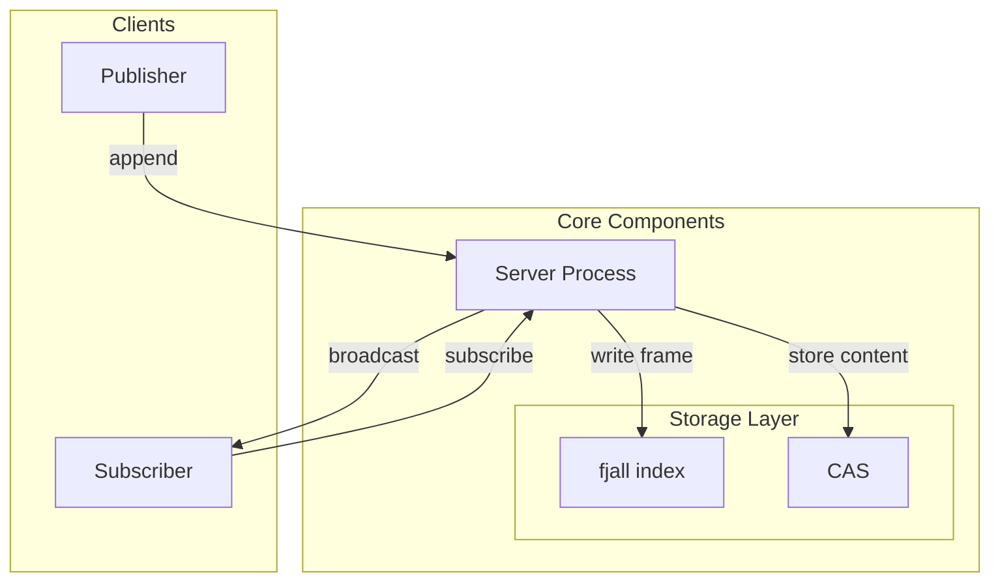

import { Link } from '../../../utils/links';

cross.stream is built on a decoupled architecture that separates event metadata from content storage, optimizing for both stream processing and content retrieval.

## Core Components

### Event Stream

The event stream uses <Link to="fjall" /> (a log-structured merge-tree store) as an append-only index for frame metadata. Each frame contains:

- Topic
- Unique ID (using SCRU128)
- Content hash (if content exists)
- Custom metadata
- TTL (Time-To-Live) settings

### Content Storage (CAS)

Content is stored separately in a Content-Addressable Storage (CAS) system implemented using cacache. Key features:

- Content is immutable
- Content is referenced by its cryptographic hash
- Multiple frames can reference the same content
- Content is stored once, regardless of how many frames reference it

### Server Process

A server process sits between clients and the store, enabling:

- Concurrent access from multiple clients
- Real-time subscriptions to new events
- Background maintenance tasks

## Data Flow

### Writing Events

When appending an event:
   - If content is provided, it's written to CAS first, generating a hash
   - A frame is created with metadata and the content hash
   - The frame is appended to the <Link to="fjall" /> index
   - The frame is broadcast to any active subscribers
   - A topic index is updated for quick head retrieval

### Reading Events

When reading the stream (`cat`):
   - Only frame metadata is retrieved from <Link to="fjall" />
   - Content remains in CAS until specifically requested
   - The stream can be read efficiently without pulling content

Content retrieval (`cas`):
   - Content is fetched from CAS using the hash from a frame
   - This is a separate operation from stream reading
   - Content is retrieved only when needed
