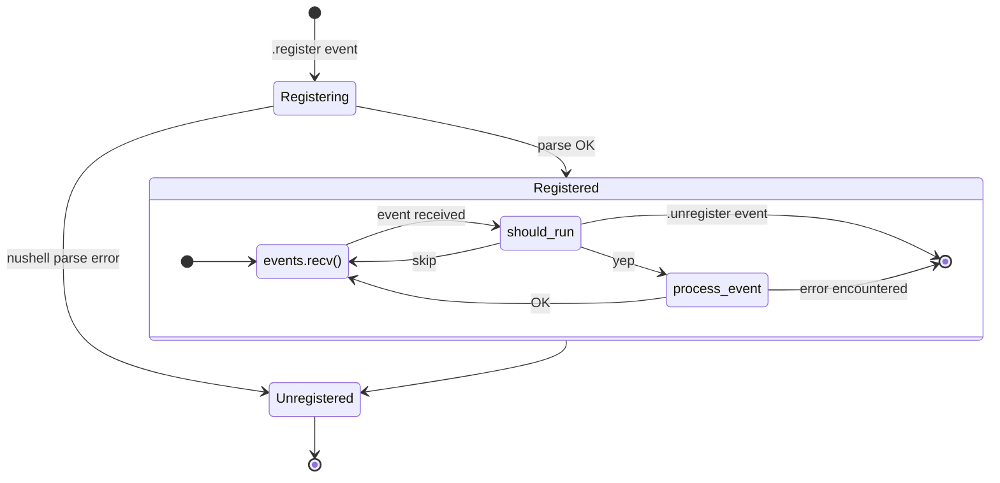

import { Aside, Tabs, TabItem } from '@astrojs/starlight/components';

import { Link } from '../../../utils/links';

cross.stream handlers use <Link to="nu" />
[closures](https://www.nushell.sh/lang-guide/chapters/types/basic_types/closure.html)
to process and act on incoming frames as they are appended to the store.

```nushell
{
  run: {|frame|
    if $frame.topic == "ping" {
      "pong" # Will be appended to handler.out
    }
  }
}
```

The handler closure receives each new frame and can:

- Process the frame's content
- Return a value (which gets automatically appended to `<handler-name>.out`)
- Explicitly append new frames using the `.append` command
- Filter which frames to process using conditionals

## Registering

To register a handler, append a registration script with the topic
`<handler-name>.register`. The script must return a record that configures the
handler's behavior:

```nushell
r###'{
  # Required: Handler closure
  run: {|frame|
    if $frame.topic == "ping" {
      "pong" # Will be appended to handler.out
    }
  }

  # Optional: Where to resume processing from
  # "tail" (default), "head", or scru128 ID
  resume_from: "tail"

  # Optional: Module definitions
  modules: {
    "my-math": "def double [x] { $x * 2 }"
  }

  # Optional: Heartbeat interval in ms
  pulse: 1000

  # Optional: Control output frame behavior
  return_options: {
    suffix: ".response" # Output topic suffix
    ttl: "head:1" # Keep only most recent frame
  }
}'### | .append echo.register
```

The `run` closure must accept **exactly one positional argument** which is the
incoming frame.

The registration script is stored in CAS and evaluated to obtain the handler's
configuration.

Upon a successful start the handler appends a `<handler-name>.registered` frame
with metadata:

- `handler_id` – the ID of the handler instance
- `tail` – whether processing started from the end of the topic
- `last_id` – the frame ID that processing resumed after (if any)

### Configuration Record Fields

| Field            | Description                                                                |
| ---------------- | -------------------------------------------------------------------------- |
| `run`            | Required handler closure that processes each frame                         |
| `resume_from`    | "tail" (default), "head", or scru128 ID to control where processing starts |
| `pulse`          | Interval in milliseconds to send synthetic xs.pulse events                 |
| `return_options` | Controls output frames: see Return Options                                 |
| `modules`        | Map of module name to the string content of the module                     |

#### Return Options

The `return_options` field controls how return values are handled:

- `suffix`: String appended to handler's name for output topic (default: ".out")
- `ttl`: Time-to-live for output frames
  - `"forever"`: Never expire
  - `"ephemeral"`: Not stored; only active subscribers receive it
  - `"time:<milliseconds>"`: Expire after duration
  - `"head:<n>"`: Keep only N most recent frames

#### Modules

The `modules` option allows handlers to use custom Nushell modules:

```nushell
r###'{
  run: {|frame|
    my-math double 8 # Use module command
  }
  modules: {
    "my-math": "export def double [x] { $x * 2 }"
  }
}'### | .append processor.register
```

## State and Environment

Handlers can maintain state using environment variables which persist between
calls:

```nushell
{
  run: {|frame|
    # Initialize or increment counter
    let env.count = ($env | get -i count | default 0) + 1
    $"Processed ($env.count) frames"
  }
} | .append counter.register
```

## Output

Handlers can produce output in two ways:

1. **Return Values**: Any non-null return value is automatically appended to the
   handler's output topic (`<handler-name>.out` by default unless modified by
   return_options.suffix)

```nushell
{|frame|
  if $frame.topic == "ping" {
    "pong" # Automatically appended to handler.out
  }
}
```

2. **Explicit Appends**: Use the `.append` command to create frames on any topic

```nushell
{|frame|
  if $frame.topic == "ping" {
    "pong" | .append response.topic --meta { "type": "response" }
    "logged" | .append audit.topic
  }
}
```

All output frames automatically include:

- `handler_id`: ID of the handler that created the frame
- `frame_id`: ID of the frame that triggered the handler
- Frames with `meta.handler_id` equal to the handler's ID are ignored to avoid
  reacting to the handler's own output

## Lifecycle



### Unregistering

A handler can be unregistered by:

- Appending `<handler-name>.unregister`
- Registering a new handler with the same name
- Runtime errors in the handler closure

When unregistered, the handler appends a confirmation frame
`<handler-name>.unregistered`. If unregistered due to an error, the frame
includes an `error` field in its metadata.

### Error Handling

If a handler encounters an error during execution:

1. The handler is automatically unregistered
2. A frame is appended to `<handler-name>.unregistered` with:
   - The error message in metadata
   - Reference to the triggering frame
