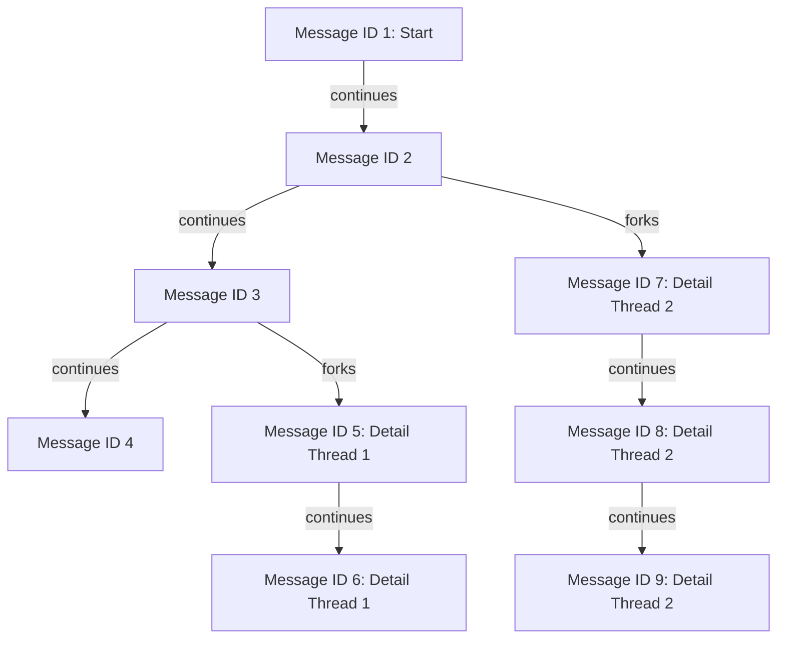

import { Aside } from '@astrojs/starlight/components';
import { Link } from '../../utils/links';

A *thread* is a chain of conversation turns where each turn knows which message it follows.
We'll use cross.stream to store those turns so we can rebuild the conversation history at any point.

## Serve

Start a local store in a separate terminal:

```bash withOutput
xs serve ./chat-store
```

## Record a conversation

In another terminal running <Link to="nu" />, import `xs.nu` for some handy commands:

```nushell
use xs.nu *
```

Now append a user message to the `chat.turn` topic:

```nushell
"What's the capital of France?" | .append chat.turn --meta {role: user}
```

Grab the ID of that turn so later messages can reference it:

```nushell
let first = (.head chat.turn).id
```

Respond with an assistant reply that continues the first turn:

```nushell

"The capital is Paris." | .append chat.turn --meta {role: assistant continues: $first}
let second = (.head chat.turn).id

"Tell me a famous landmark there." | .append chat.turn --meta {role: user continues: $second}
let third = (.head chat.turn).id

"The Eiffel Tower is one of the most famous." | .append chat.turn --meta {role: assistant continues: $third}
```

## Following a thread

The `continues` field forms a linked list. We can walk that list to rebuild the conversation.
Here is a small helper that follows the chain from the most recent turn back to the start:

```nushell
def thread [id] {
  if $id == null { return [] }
  let f = .get $id
  thread ($f.meta?.continues?) | append $f
}

thread (.head chat.turn).id | each {.cas}
```

This prints:

```text
What's the capital of France?
The capital is Paris.
Tell me a famous landmark there.
The Eiffel Tower is one of the most famous.
```

## Branching the conversation

Because each turn records which message it continues from, you can fork a new branch at any point.

Continuing from `$third` creates a detail thread about the landmark:

```nushell
"What is its height?" | .append chat.turn --meta {role: user continues: $third}
"The Eiffel Tower is about 300 meters tall." | .append chat.turn --meta {role: assistant continues: (.head chat.turn).id}
```

You can also fork from an earlier turn. Continuing again from `$second` starts a different thread:

```nushell
"What about Germany?" | .append chat.turn --meta {role: user continues: $second}
let g1 = (.head chat.turn).id
"Germany's capital is Berlin." | .append chat.turn --meta {role: assistant continues: $g1}
"How big is Berlin?" | .append chat.turn --meta {role: user continues: (.head chat.turn).id}
```

You will now see multiple branches starting from the earlier messages.



<Aside>
For a full-featured project that manages LLM conversations this way, see
<a href="https://github.com/cablehead/gpt2099.nu" target="_blank" rel="noopener noreferrer">gpt2099</a>.
</Aside>

