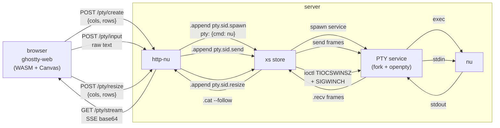
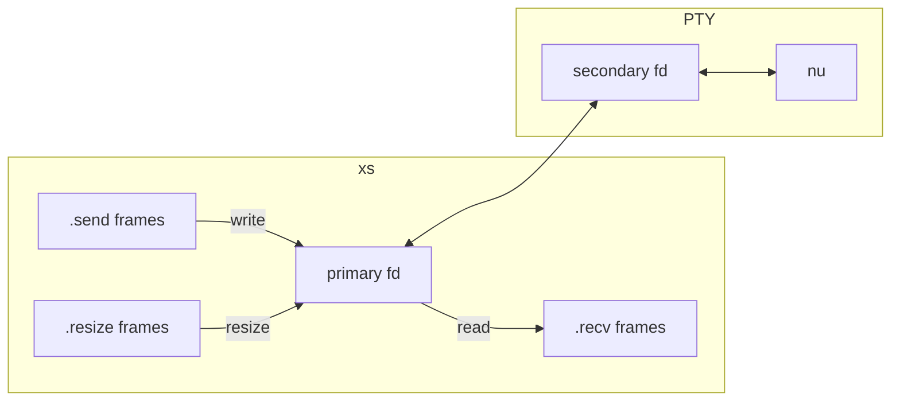

import { Aside } from '@astrojs/starlight/components';
import { Link } from '../../../utils/links';

This tutorial wires together three pieces to put a real shell in the browser:

- **xs** allocates and manages a pseudo-terminal via its PTY service
- **http-nu** exposes the PTY over four HTTP endpoints
- **ghostty-web** renders the terminal in a canvas element using Ghostty's VT100 engine compiled to WASM

Here is the full picture:



The rest of this tutorial builds each layer from the inside out: PTY, then
HTTP, then browser.

## Prerequisites

- xs installed and on your PATH (see <Link to="/getting-started/installation/">Installation</Link>)
- http-nu installed with `--store` support
- ghostty-web built (`bun run build`) with dist assets available
- A terminal running <Link to="nu" /> with `use xs.nu *`

## Start a store

```bash withOutput
xs serve ./store
```

Leave this running.

## The PTY service

A normal xs service uses `run` with a closure. For PTY mode, `run` is a command
string and `pty` provides the terminal dimensions:

```nushell
r#'{
  run: "/usr/local/bin/nu"
  pty: {cols: 131, rows: 50}
}'# | .append my-shell.spawn
```

When xs sees a `pty` field in the spawn config, it:

1. Allocates a pseudo-terminal with the given size (openpty on Unix, ConPTY on Windows)
2. Spawns the `run` command inside the PTY
3. Reads the primary fd and emits raw bytes as `<topic>.recv` frames (content stored in CAS)
4. Watches for `<topic>.send` frames and writes their CAS content to the primary fd
5. Watches for `<topic>.resize` frames and applies `cols`/`rows` from frame metadata

PTY mode is inherently bidirectional. No `duplex` flag needed.



The full lifecycle (`running`, `stopped`, `shutdown`, auto-restart, hot reload,
terminate) works the same as closure-based services.

## The http-nu handler

The handler script bridges four HTTP endpoints to the PTY service topics.
Save this as `serve.nu`:

```nushell
use http-nu/router *

{|req|
  dispatch $req [

    # Create a new PTY session
    (route {method: "POST", path: "/pty/create"} {|req ctx|
      let body = ($in | from json)
      let cols = ($body.cols? | default 80)
      let rows = ($body.rows? | default 24)
      let sid = (random uuid)

      # Spawn the PTY service
      $"{ run: \"/usr/local/bin/nu\", pty: {cols: ($cols), rows: ($rows)} }"
      | .append $"pty.($sid).spawn"

      {sid: $sid} | to json
    })

    # Stream PTY output as SSE
    (route {method: "GET", path: "/pty/stream"} {|req ctx|
      let sid = $req.query.sid
      .head $"pty.($sid).recv" --follow
      | each {|frame|
        let bytes = (.cas $frame.hash)
        {data: ($bytes | encode base64)}
      }
      | to sse
    })

    # Send keyboard input to the PTY
    (route {method: "POST", path: "/pty/input"} {|req ctx|
      let sid = $req.query.sid
      $in | .append $"pty.($sid).send"
      null | metadata set --merge {'http.response': {status: 204}}
    })

    # Resize the PTY
    (route {method: "POST", path: "/pty/resize"} {|req ctx|
      let body = ($in | from json)
      let sid = $req.query.sid
      .append $"pty.($sid).resize" --meta {cols: $body.cols, rows: $body.rows}
      null | metadata set --merge {'http.response': {status: 204}}
    })
  ]
}
```

Each endpoint maps to a PTY service topic:

| Endpoint | Store topic | Direction |
| --- | --- | --- |
| `POST /pty/create` | `pty.<sid>.spawn` | client -> xs |
| `GET /pty/stream` | `pty.<sid>.recv` | xs -> client (SSE) |
| `POST /pty/input` | `pty.<sid>.send` | client -> xs |
| `POST /pty/resize` | `pty.<sid>.resize` | client -> xs |

The stream endpoint uses `.head <topic> --follow` to tail new recv frames as
they arrive, base64-encodes the CAS content, and pipes through `to sse`. The
client receives a standard `text/event-stream` where each `data:` line carries
base64-encoded terminal output.

## The client

ghostty-web compiles Ghostty's VT100 parser and renderer to a 416KB WASM binary.
TypeScript handles canvas rendering, keyboard input, and clipboard. The terminal
itself is transport-agnostic: `term.write()` pushes bytes in, `term.onData()`
captures keystrokes out.

The demo client (`sse-client.html`) connects the four endpoints:

```javascript
// 1. Create session
const { sid } = await fetch('/pty/create', {
  method: 'POST',
  headers: { 'Content-Type': 'application/json' },
  body: JSON.stringify({ cols: term.cols, rows: term.rows }),
}).then(r => r.json());

// 2. Stream output via SSE
const source = new EventSource('/pty/stream?sid=' + sid);
source.onmessage = (e) => {
  const bytes = Uint8Array.from(atob(e.data), c => c.charCodeAt(0));
  term.write(bytes);
};

// 3. Send keystrokes via POST
term.onData((data) => {
  fetch('/pty/input?sid=' + sid, { method: 'POST', body: data });
});

// 4. Send resize via POST
term.onResize(({ cols, rows }) => {
  fetch('/pty/resize?sid=' + sid, {
    method: 'POST',
    headers: { 'Content-Type': 'application/json' },
    body: JSON.stringify({ cols, rows }),
  });
});
```

SSE downstream, POST upstream. No WebSocket upgrade required. Works through
HTTP proxies and tunnels.

## Try it

Start everything in three terminals.

Terminal 1 -- the store (already running from above):

```bash withOutput
xs serve ./store
```

Terminal 2 -- http-nu, pointing at the store and serving ghostty-web assets:

```bash withOutput
http-nu :3001 --store ./store ./serve.nu
```

Terminal 3 -- open the browser:

```bash withOutput
open http://localhost:3001
```

<Aside type="tip">
If you are using the standalone `sse-client.html`, set `window.GHOSTTY_SERVER`
to point at the http-nu address and serve the page separately. The demo server
in ghostty-web (`demo/bin/demo-sse.js`) bundles everything in one process for
convenience.
</Aside>

You should see a nushell prompt rendered in the browser. Type commands, watch
output stream back. Every keystroke flows through xs as a `pty.<sid>.send`
frame; every chunk of terminal output flows back as a `pty.<sid>.recv` frame.

## Resize

Resize the browser window. ghostty-web's `FitAddon` recalculates cols and rows,
fires `term.onResize`, and the client POSTs to `/pty/resize`. http-nu appends a
`pty.<sid>.resize` frame with `{cols, rows}` in metadata. xs applies the new
dimensions via `ioctl TIOCSWINSZ` and sends `SIGWINCH` to the child process.
The shell redraws to fit.

## Terminate

End a PTY session from the store side:

```nushell
.append pty.<sid>.terminate
```

xs kills the child process (SIGTERM, then SIGKILL if needed), emits
`pty.<sid>.stopped` with `meta.reason` set to `terminate`, then
`pty.<sid>.shutdown`. The SSE stream ends and ghostty-web shows a session-ended
message.

## Recap

| Component | Role |
| --- | --- |
| xs | Allocates the PTY, manages the child process, streams I/O as frames |
| http-nu | Bridges HTTP endpoints to store topics |
| ghostty-web | Renders VT100 output in a canvas, captures keyboard input |

The PTY service handles the low-level terminal plumbing. http-nu translates
HTTP to frames. ghostty-web handles rendering. Each piece does one thing.
